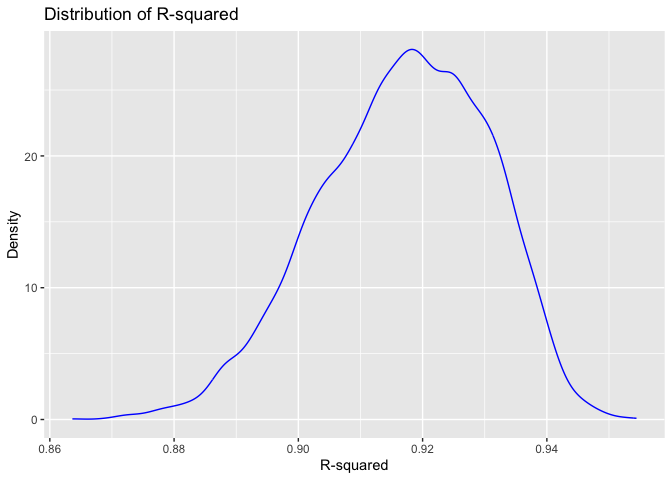

Homework 6
================
Vicky Mello
November 30, 2023

``` r
library(tidyverse)
```

    ## ── Attaching core tidyverse packages ──────────────────────── tidyverse 2.0.0 ──
    ## ✔ dplyr     1.1.3     ✔ readr     2.1.4
    ## ✔ forcats   1.0.0     ✔ stringr   1.5.0
    ## ✔ ggplot2   3.4.3     ✔ tibble    3.2.1
    ## ✔ lubridate 1.9.2     ✔ tidyr     1.3.0
    ## ✔ purrr     1.0.2     
    ## ── Conflicts ────────────────────────────────────────── tidyverse_conflicts() ──
    ## ✖ dplyr::filter() masks stats::filter()
    ## ✖ dplyr::lag()    masks stats::lag()
    ## ℹ Use the conflicted package (<http://conflicted.r-lib.org/>) to force all conflicts to become errors

``` r
library(modelr)
```

### Problem 1

In the data cleaning code below we create a `city_state` variable,
change `victim_age` to numeric, modifiy victim_race to have categories
white and non-white, with white as the reference category, and create a
`resolution` variable indicating whether the homicide is solved. Lastly,
we filtered out the following cities: Tulsa, AL; Dallas, TX; Phoenix,
AZ; and Kansas City, MO; and we retained only the variables
`city_state`, `resolution`, `victim_age`, `victim_sex`, and
`victim_race`.

``` r
homicide_df = 
  read_csv("data/homicide-data.csv", na = c("", "NA", "Unknown")) |> 
  mutate(
    city_state = str_c(city, state, sep = ", "),
    victim_age = as.numeric(victim_age),
    resolution = case_when(
      disposition == "Closed without arrest" ~ 0,
      disposition == "Open/No arrest"        ~ 0,
      disposition == "Closed by arrest"      ~ 1)
  ) |> 
  filter(victim_race %in% c("White", "Black")) |> 
  filter(!(city_state %in% c("Tulsa, AL", "Dallas, TX", "Phoenix, AZ", "Kansas City, MO"))) |> 
  select(city_state, resolution, victim_age, victim_sex, victim_race)
```

    ## Rows: 52179 Columns: 12
    ## ── Column specification ────────────────────────────────────────────────────────
    ## Delimiter: ","
    ## chr (8): uid, victim_last, victim_first, victim_race, victim_sex, city, stat...
    ## dbl (4): reported_date, victim_age, lat, lon
    ## 
    ## ℹ Use `spec()` to retrieve the full column specification for this data.
    ## ℹ Specify the column types or set `show_col_types = FALSE` to quiet this message.

Next we fit a logistic regression model using only data from Baltimore,
MD. We model `resolved` as the outcome and `victim_age`, `victim_sex`,
and `victim_race` as predictors. We save the output as `baltimore_glm`
so that we can apply `broom::tidy` to this object and obtain the
estimate and confidence interval of the adjusted odds ratio for solving
homicides comparing non-white victims to white victims.

``` r
baltimore_glm = 
  filter(homicide_df, city_state == "Baltimore, MD") |> 
  glm(resolution ~ victim_age + victim_sex + victim_race, family = binomial(), data = _)

baltimore_glm |> 
  broom::tidy() |> 
  mutate(
    OR = exp(estimate), 
    OR_CI_upper = exp(estimate + 1.96 * std.error),
    OR_CI_lower = exp(estimate - 1.96 * std.error)) |> 
  filter(term == "victim_sexMale") |> 
  select(OR, OR_CI_lower, OR_CI_upper) |>
  knitr::kable(digits = 3)
```

|    OR | OR_CI_lower | OR_CI_upper |
|------:|------------:|------------:|
| 0.426 |       0.325 |       0.558 |

Below, by incorporating `nest()`, `map()`, and `unnest()` into the
preceding Baltimore-specific code, we fit a model for each of the
cities, and extract the adjusted odds ratio (and CI) for solving
homicides comparing non-white victims to white victims. We show the
first 5 rows of the resulting dataframe of model results.

``` r
model_results = 
  homicide_df |> 
  nest(data = -city_state) |> 
  mutate(
    models = map(data, \(df) glm(resolution ~ victim_age + victim_sex + victim_race, 
                             family = binomial(), data = df)),
    tidy_models = map(models, broom::tidy)) |> 
  select(-models, -data) |> 
  unnest(cols = tidy_models) |> 
  mutate(
    OR = exp(estimate), 
    OR_CI_upper = exp(estimate + 1.96 * std.error),
    OR_CI_lower = exp(estimate - 1.96 * std.error)) |> 
  filter(term == "victim_sexMale") |> 
  select(city_state, OR, OR_CI_lower, OR_CI_upper)

model_results |>
  slice(1:5) |> 
  knitr::kable(digits = 3)
```

| city_state      |    OR | OR_CI_lower | OR_CI_upper |
|:----------------|------:|------------:|------------:|
| Albuquerque, NM | 1.767 |       0.831 |       3.761 |
| Atlanta, GA     | 1.000 |       0.684 |       1.463 |
| Baltimore, MD   | 0.426 |       0.325 |       0.558 |
| Baton Rouge, LA | 0.381 |       0.209 |       0.695 |
| Birmingham, AL  | 0.870 |       0.574 |       1.318 |

Below we generate a plot of the estimated ORs and CIs for each city,
ordered by magnitude of the OR from smallest to largest. From this plot
we see that most cities have odds ratios that are smaller than 1,
suggesting that crimes with male victims have smaller odds of resolution
compared to crimes with female victims after adjusting for victim age
and race. This disparity is strongest in New yrok. In roughly half of
these cities, confidence intervals are narrow and do not contain 1,
suggesting a significant difference in resolution rates by sex after
adjustment for victim age and race.

``` r
model_results |> 
  mutate(city_state = fct_reorder(city_state, OR)) |> 
  ggplot(aes(x = city_state, y = OR)) + 
  geom_point() + 
  geom_errorbar(aes(ymin = OR_CI_lower, ymax = OR_CI_upper)) + 
  theme(axis.text.x = element_text(angle = 90, hjust = 1))
```

<!-- -->

### Problem 2

``` r
## Download the Data:

weather_df = 
  rnoaa::meteo_pull_monitors(
    c("USW00094728"),
    var = c("PRCP", "TMIN", "TMAX"), 
    date_min = "2022-01-01",
    date_max = "2022-12-31") |>
  mutate(
    name = recode(id, USW00094728 = "CentralPark_NY"),
    tmin = tmin / 10,
    tmax = tmax / 10) |>
  select(name, id, everything())
```

    ## using cached file: /Users/vickymello/Library/Caches/org.R-project.R/R/rnoaa/noaa_ghcnd/USW00094728.dly

    ## date created (size, mb): 2023-09-29 12:01:15.029303 (8.525)

    ## file min/max dates: 1869-01-01 / 2023-09-30

``` r
lm(tmax ~ tmin + prcp, data = weather_df)
```

    ## 
    ## Call:
    ## lm(formula = tmax ~ tmin + prcp, data = weather_df)
    ## 
    ## Coefficients:
    ## (Intercept)         tmin         prcp  
    ##    8.042803     1.013386    -0.001541

``` r
bootstrap_sample = function(df) {
  sample_frac(df, replace=TRUE)
}

bootstraps = 
  tibble(strap_number = 1:5000) %>% 
  mutate(
    sample_strap = map(strap_number, ~bootstrap_sample(df = weather_df))
  )

bootstraps %>% 
  slice(1:3) %>% 
  mutate(sample_strap = map(sample_strap, arrange, tmax)) %>%  
  pull(sample_strap)
```

    ## [[1]]
    ## # A tibble: 365 × 6
    ##    name           id          date        prcp  tmax  tmin
    ##    <chr>          <chr>       <date>     <dbl> <dbl> <dbl>
    ##  1 CentralPark_NY USW00094728 2022-12-24     0  -9.3 -13.8
    ##  2 CentralPark_NY USW00094728 2022-01-15     0  -6   -12.1
    ##  3 CentralPark_NY USW00094728 2022-01-21     0  -5.5  -9.9
    ##  4 CentralPark_NY USW00094728 2022-01-11     0  -4.3  -9.3
    ##  5 CentralPark_NY USW00094728 2022-02-14     0  -3.8  -8.8
    ##  6 CentralPark_NY USW00094728 2022-01-30     0  -3.2 -11  
    ##  7 CentralPark_NY USW00094728 2022-02-05     0  -2.7  -7.1
    ##  8 CentralPark_NY USW00094728 2022-02-05     0  -2.7  -7.1
    ##  9 CentralPark_NY USW00094728 2022-02-05     0  -2.7  -7.1
    ## 10 CentralPark_NY USW00094728 2022-12-25     0  -2.1  -9.9
    ## # ℹ 355 more rows
    ## 
    ## [[2]]
    ## # A tibble: 365 × 6
    ##    name           id          date        prcp  tmax  tmin
    ##    <chr>          <chr>       <date>     <dbl> <dbl> <dbl>
    ##  1 CentralPark_NY USW00094728 2022-01-11     0  -4.3  -9.3
    ##  2 CentralPark_NY USW00094728 2022-01-11     0  -4.3  -9.3
    ##  3 CentralPark_NY USW00094728 2022-02-14     0  -3.8  -8.8
    ##  4 CentralPark_NY USW00094728 2022-01-30     0  -3.2 -11  
    ##  5 CentralPark_NY USW00094728 2022-02-05     0  -2.7  -7.1
    ##  6 CentralPark_NY USW00094728 2022-02-05     0  -2.7  -7.1
    ##  7 CentralPark_NY USW00094728 2022-02-05     0  -2.7  -7.1
    ##  8 CentralPark_NY USW00094728 2022-01-26     0  -2.1  -6.6
    ##  9 CentralPark_NY USW00094728 2022-12-25     0  -2.1  -9.9
    ## 10 CentralPark_NY USW00094728 2022-12-25     0  -2.1  -9.9
    ## # ℹ 355 more rows
    ## 
    ## [[3]]
    ## # A tibble: 365 × 6
    ##    name           id          date        prcp  tmax  tmin
    ##    <chr>          <chr>       <date>     <dbl> <dbl> <dbl>
    ##  1 CentralPark_NY USW00094728 2022-12-24     0  -9.3 -13.8
    ##  2 CentralPark_NY USW00094728 2022-12-25     0  -2.1  -9.9
    ##  3 CentralPark_NY USW00094728 2022-12-26     0  -1.6  -7.7
    ##  4 CentralPark_NY USW00094728 2022-01-29   196  -1.6 -11  
    ##  5 CentralPark_NY USW00094728 2022-12-26     0  -1.6  -7.7
    ##  6 CentralPark_NY USW00094728 2022-02-06     0  -1    -8.2
    ##  7 CentralPark_NY USW00094728 2022-01-28    33   0    -1.6
    ##  8 CentralPark_NY USW00094728 2022-01-28    33   0    -1.6
    ##  9 CentralPark_NY USW00094728 2022-01-27     0   0    -8.2
    ## 10 CentralPark_NY USW00094728 2022-03-28     0   0.6  -4.9
    ## # ℹ 355 more rows

``` r
# Fit our model on each sample 

results_bootstrap = 
  bootstraps %>%  
  mutate(
    models = map(sample_strap, ~lm(tmax ~ tmin + prcp, data = .)
  ), 
    results = map(models, broom::tidy),
    r_squared = map_dbl(models, ~broom::glance(.x)$r.squared),
    log_beta = map_dbl(models, ~ {
      coef <- coefficients(.x)
      if (coef[2] * coef[3] >= 0) log(coef[2] * coef[3]) else NA_real_
    })
  ) %>% 
  select(-sample_strap, -models) %>% 
  unnest(results)
```

Distribution Plots for r squared and log beta:

``` r
# Distribution plot for R-squared
rs_estimate_plot = 
  results_bootstrap %>% 
ggplot(aes(x = r_squared)) +
  geom_density(color = "blue") +
  labs(x = "R-squared", y = "Density", title = "Distribution of R-squared")

rs_estimate_plot
```

<!-- -->

``` r
# Distribution plot for log(beta)
logbeta_estimate_plot = 
  results_bootstrap %>% 
ggplot(aes(x = log_beta)) +
  geom_density(color = "red") +
  labs(x = "log(beta1 * beta2)", y = "Density", title = "Distribution of log(beta)")

logbeta_estimate_plot
```

    ## Warning: Removed 10032 rows containing non-finite values (`stat_density()`).

<!-- -->
The R squared plot appears to follow a normal distribution with slight
leftward skew that is likely a product of random sampling variability.
However, the log beta plot is highly skewed to the left which may be the
result of there being negative beta estimates that were not able to be
used for calculating the log estimates. This strong leftward skew
suggests that these log beta estimates may not be representative of the
underlying data set.

95% Confidence Intervals:

``` r
# Calculate 95% confidence intervals for R squared and log beta
ci_rsquared = quantile(results_bootstrap$r_squared, c(0.025, 0.975))
ci_log_beta = quantile(results_bootstrap$log_beta, c(0.025, 0.975), na.rm = TRUE)

# Display confidence interval results
print(paste("95% CI for R-squared: [", round(ci_rsquared[1], 4), ",", round(ci_rsquared[2], 4), "]"))
```

    ## [1] "95% CI for R-squared: [ 0.8887 , 0.9408 ]"

``` r
print(paste("95% CI for log(beta1 * beta2): [", round(ci_log_beta[1], 4), ",", round(ci_log_beta[2], 4), "]"))
```

    ## [1] "95% CI for log(beta1 * beta2): [ -9.037 , -4.5436 ]"

### Problem 3
